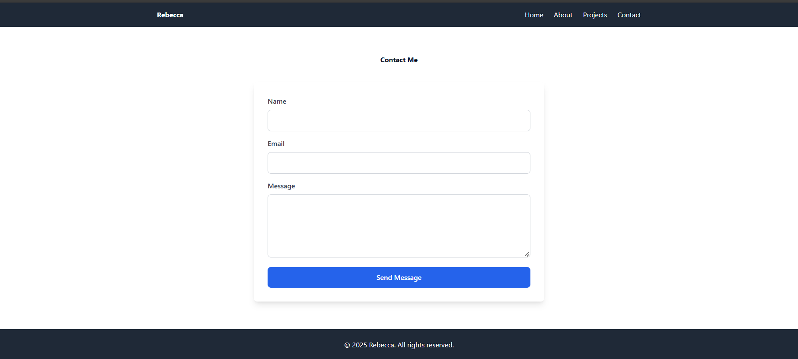

# PERSONAL_PORTIFOLIO_WEBSITE

## 📌 Project Overview
This is my personal portfolio website built with *HTML5* and *Tailwind CSS*.  
It serves as a professional space to showcase my skills, projects, and career goals.  

The portfolio is fully responsive and includes multiple sections: Home, About, Projects, and Contact.  

---

## 🎯 Purpose
The purpose of this project is to:
- Practice *semantic HTML5* structure.
- Apply *Tailwind CSS* for styling and responsiveness.
- Learn and apply *version control* using GitHub.
- Build a professional portfolio for future employers and clients.

---

## 📂 Pages Included
1. *Home (index.html)* – Landing page with hero section and navigation.  
2. *About Me (about.html)* – My background, education, skills, and career goals.  
3. *Projects (projects.html)* – Showcases 3 projects with descriptions.  
4. *Contact (contact.html)* – Contact form for visitors to reach out.  

---

## 🖼 Screenshots
### Homepage
)

### About Page
)

### Projects Page
)

### Contact Page
![contact screenshor]{}

---

## 🚀 Deployment
The project can be viewed live at:  
https://boldecca.github.io/PERSONAL_PORTIFOLIO_WEBSITE/ 

---

## ⚙ How to Run Locally
1. Clone the repository:
   ```bash
   git clone https://github.com/Boldecca/PERSONAL_PORTIFOLIO_WEBSITE.git